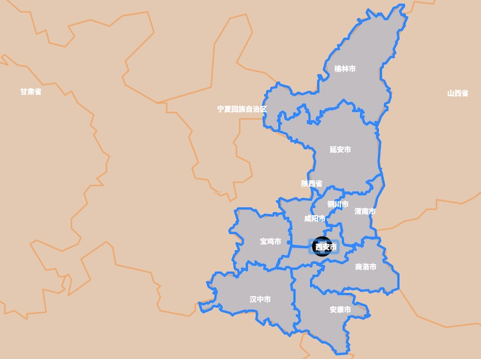
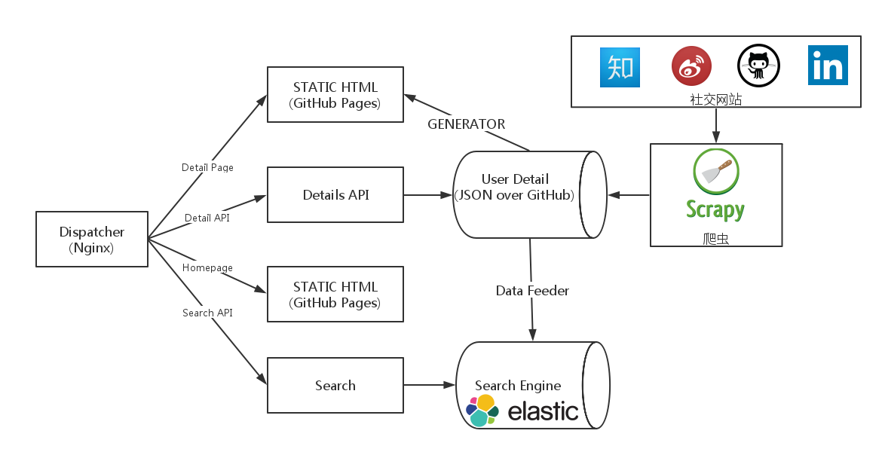

#V Map

V Map是一个以GitHub用户的信息为数据，基于ElasticSearch与Leaflet的先进WebGIS系统。它提供了强大的地理信息搜索功能，你不仅可以通过用户名、地点来搜索用户，你还可以使用自定义形状的多边形搜索（polygon search）:



V Map的系统架构是《[CQRS + 微服务](http://mp.weixin.qq.com/s?__biz=MjM5Mjg4NDMwMA==&mid=405256367&idx=1&sn=c2a9ef84ac5115332ffa49c0b6aea829#rd)》，即使用“编程-开发-发布分离”来完成CQRS，并抽象出一系列的微服务。其系统架构如下图所示：



子系统
---

 - [bang](https://github.com/phodal/vmap-bang): the Detail Page generator of V Map
 - [bot](https://github.com/phodal/vmap-bot): Index Data to ElasticSearch
 - [fang](https://github.com/phodal/vmap-fang): Data Mining of V Map
 - [four](https://github.com/phodal/vmap-four): The Data Crawl of V Map
 - [xunv](https://github.com/phodal/xunv): Search Result Page of V Map

Tech Stack
---

 - Leaflet
 - Bootstrap
 - ElasticSearch
 - jQuery

添加新用户
---

修改用户数据文件 ``/static/js/v_data.js``

格式: 
```
{
    name: {用户名},
    latLang: [{经度}, {纬度}]
}
```

ps: 经纬度可以由Google Map搜索地址获得.

如

```
{
    name: "Phodal",
    latLang: [34.2173804, 108.8981328]
}
```

截图
---


**欢迎关注我的微信公众号: phodal**


License
---

© 2016 A [Phodal Huang](https://www.phodal.com)'s [Idea](http://github.com/phodal/ideas). This code is distributed under the MIT license. See `LICENSE` in this directory.

[待我代码编成，娶你为妻可好](http://www.xuntayizhan.com/person/ji-ke-ai-qing-zhi-er-shi-dai-wo-dai-ma-bian-cheng-qu-ni-wei-qi-ke-hao-wan/) @ [花仲马](https://github.com/hug8217)
